# 🛴 B2-Ride: IoT Scooter Monitoring System (PoC)


**B2-Ride** è una Proof of Concept (PoC) per un sistema di monitoraggio in tempo reale di una flotta di monopattini elettrici condivisi.
Il progetto simula un'architettura **IoT End-to-End**: dalla generazione dei dati di telemetria (GPS/Batteria) alla visualizzazione su mappa, passando per l'ingestion ad alta velocità e la persistenza su database relazionale.

---

## 🏗️ Componenti Chiave

* **Simulator (IoT Edge):** Script Node.js che simula il movimento fisico di 2 veicoli (S01, S02) su un percorso geografico reale (Milano), trasmettendo telemetria ogni 3 secondi.

* **Message Broker:** Eclipse Mosquitto gestisce le comunicazioni asincrone tramite protocollo MQTT.

* **Backend (Ingestion & API):**
    * Sottoscrive i topic MQTT per l'ingestion dei dati.
    * Esegue operazioni di Upsert (Update or Insert) su PostgreSQL per mantenere lo stato "live" della flotta.
    * Espone API REST per il frontend.

* **Database:** PostgreSQL 15 containerizzato.

* **Frontend:** Dashboard Angular 21 con mappe interattive Leaflet e rendering vettoriale dei veicoli.

---

## 💻 Tech Stack

* **Infrastructure:** Docker & Docker Compose
* **Backend:** Node.js, Express, MQTT.js, pg (node-postgres)
* **Database:** PostgreSQL 15 (Alpine)
* **Broker:** Eclipse Mosquitto
* **Frontend:** Angular (Standalone Components), Leaflet.js
* **Dev Environment:** GitHub Codespaces

---

## 🛠️ Installazione e Avvio (Quick Start)

Il progetto è ottimizzato per GitHub Codespaces, ma può girare su qualsiasi macchina con Docker e Node.js installati.

### 1. Avvio Infrastruttura (Docker)
Avvia il Database e il Broker MQTT in container isolati:

```bash
docker-compose up -d
```

## 🏗️ Architettura del Sistema

Il sistema è progettato seguendo un approccio a microservizi ibrido, utilizzando **Docker** per l'infrastruttura stateful e **Node.js/Angular** per la logica applicativa.

```mermaid
graph LR
    Sim[🛴 Simulator Node.js] -- MQTT (1883) --> Broker[📡 Mosquitto]
    Broker -- Sub --> BE[⚙️ Backend Node.js]
    BE -- SQL Upsert --> DB[(🐘 PostgreSQL)]
    FE[💻 Frontend Angular] -- HTTP REST --> BE
```



## 🏗️ Componenti Chiave

Simulator (IoT Edge): Script Node.js che simula il movimento fisico di 2 veicoli (S01, S02) su un percorso geografico reale (Milano), trasmettendo telemetria ogni 3 secondi.

Message Broker: **Eclipse Mosquitto** gestisce le comunicazioni asincrone tramite protocollo **MQTT**.

Backend (Ingestion & API): sottoscrive i topic MQTT per l'ingestion dei dati.

Esegue operazioni di Upsert (Update or Insert) su PostgreSQL per mantenere lo stato "live" della flotta.

Espone API REST per il frontend.

Database: PostgreSQL 15 containerizzato.

Frontend: Dashboard Angular 21 con mappe interattive Leaflet e rendering vettoriale dei veicoli.

----

Infrastructure: Docker & Docker Compose

Backend: Node.js, Express, MQTT.js, pg (node-postgres)

Database: PostgreSQL 15 (Alpine)

Broker: Eclipse Mosquitto

Frontend: Angular (Standalone Components), Leaflet.js

Dev Environment: GitHub Codespaces

----

🛠️ Installazione e Avvio (Quick Start)
Il progetto è ottimizzato per GitHub Codespaces, ma può girare su qualsiasi macchina con Docker e Node.js installati.

1. Avvio Infrastruttura (Docker)
Avvia il Database e il Broker MQTT in container isolati:

Bash
docker-compose up -d

2. Inizializzazione Database
Crea la tabella scooters e i dati di seed:

Bash

cd server
npm install
node init-db.js

3. Avvio Backend
Il server ascolterà su MQTT per i dati e sulla porta 3000 per le API:

Bash

node index.js

4. Avvio Simulatore
In un nuovo terminale, avvia la flotta virtuale:

Bash

cd simulator
npm install
node simulator.js
Dovresti vedere i log: 📡 Inviato S01...

5. Avvio Frontend
In un terzo terminale, avvia la dashboard Angular:

Bash

cd client
npm install
npx ng serve --host 0.0.0.0

Nota per Codespaces: Assicurati di rendere Public la porta 3000 nel pannello "Ports" di VS Code, altrimenti il frontend non potrà comunicare con il backend.

-----

Decisioni Architetturali (Design Choices)
Separazione Ingestion/Consumption: L'uso di MQTT disaccoppia i dispositivi dal server. In uno scenario di produzione, questo permette di scalare i consumer indipendentemente dal numero di dispositivi connessi.

PostgreSQL Upsert Strategy:

SQL

INSERT INTO scooters (...) ON CONFLICT (id) DO UPDATE ...
Questa scelta rende il sistema autoconsistente. Non è necessario pre-registrare i veicoli: appena un nuovo scooter trasmette, viene automaticamente censito nel sistema (Device Provisioning automatico).

Leaflet CircleMarkers: Al posto di icone statiche, sono stati utilizzati marker vettoriali per garantire performance elevate e visibilità a qualsiasi livello di zoom senza errori di caricamento risorse.

🔮 Roadmap Futura
Le seguenti funzionalità sono previste per la versione 2.0 (Production Ready):

[ ] Data Lake: Aggiunta di una tabella ride_history (Time-series) per storicizzare i percorsi e calcolare il chilometraggio.

[ ] Message Queue: Introduzione di RabbitMQ tra Mosquitto e Node.js per garantire la persistenza dei messaggi in caso di picchi di traffico (Load Leveling).

[ ] WebSockets: Sostituzione del polling HTTP con Socket.io per aggiornamenti mappa push in tempo reale.

[ ] Authentication: Implementazione JWT per proteggere le API backend.

[ ] Dockerizzazione Totale: Containerizzazione anche dei servizi Node e Angular (Nginx) per deploy su Kubernetes.