# 🛴 B2-Ride: IoT Scooter Monitoring System (PoC)


**B2-Ride** è una Proof of Concept (PoC) per un sistema di monitoraggio in tempo reale di una flotta di monopattini elettrici condivisi.
Il progetto simula un'architettura **IoT End-to-End**: dalla generazione dei dati di telemetria (GPS/Batteria) alla visualizzazione su mappa, passando per l'ingestion ad alta velocità e la persistenza su database relazionale.

---

## 🏗️ Componenti Chiave

* **Frontend:** Dashboard **Angular** con mappe interattive **Leaflet**.
    * Rendering vettoriale (`CircleMarker`) per massime performance.
    * Comunicazione **Real-Time via Socket.io**: il client non fa polling, ma riceve eventi push dal server per aggiornamenti a latenza zero.

* **Simulator (IoT Edge):** Script Node.js che simula il movimento fisico di 2 veicoli (S01, S02) su un percorso geografico reale (Milano), trasmettendo telemetria ogni 3 secondi.

* **Message Broker:** Eclipse Mosquitto gestisce le comunicazioni asincrone tramite protocollo MQTT.

* **Backend (Ingestion & API):**
    * Sottoscrive i topic MQTT per l'ingestion dei dati.
    * Esegue operazioni di Upsert (Update or Insert) su PostgreSQL per mantenere lo stato "live" della flotta.
    * Espone API REST per il frontend.

* **Database:** PostgreSQL 15 containerizzato.

* **Frontend:** Dashboard Angular 21 con mappe interattive Leaflet e rendering vettoriale dei veicoli.

---

## 💻 Tech Stack

* **Infrastructure:** Docker & Docker Compose
* **Backend:** Node.js, Express, MQTT.js, pg (node-postgres)
* **Database:** PostgreSQL 15 (Alpine)
* **Broker:** Eclipse Mosquitto
* **Frontend:** Angular (Standalone Components), Leaflet.js
* **Dev Environment:** GitHub Codespaces
---

## 🔮 Roadmap Futura

Le seguenti funzionalità sono previste per la versione 2.0 (Production Ready):

- [x] **WebSockets:** Implementati! (Socket.io sostituisce HTTP polling).
- [ ] **Data Lake:** Aggiunta di una tabella `ride_history` (Time-series) per storicizzare i percorsi e calcolare il chilometraggio.
- [ ] **Message Queue:** Introduzione di **RabbitMQ** tra Mosquitto e Node.js per garantire la persistenza dei messaggi in caso di picchi di traffico (Load Leveling).
- [ ] **Authentication:** Implementazione JWT per proteggere le API backend.
- [ ] **Dockerizzazione Totale:** Containerizzazione anche dei servizi Node e Angular (Nginx) per deploy su Kubernetes.

---

## 🛠️ Installazione e Avvio (Quick Start)

Il progetto è ottimizzato per GitHub Codespaces, ma può girare su qualsiasi macchina con Docker e Node.js installati.

### 1. Avvio Infrastruttura (Docker)
Avvia il Database e il Broker MQTT in container isolati:

```bash
docker-compose up -d
```

## 🏗️ Architettura del Sistema

Il sistema è progettato seguendo un approccio a microservizi ibrido, utilizzando **Docker** per l'infrastruttura stateful e **Node.js/Angular** per la logica applicativa.

```mermaid
graph LR
    Sim[🛴 Simulator Node.js] -- MQTT (1883) --> Broker[📡 Mosquitto]
    Broker -- Sub --> BE[⚙️ Backend Node.js]
    BE -- SQL Upsert --> DB[(🐘 PostgreSQL)]
    FE[💻 Frontend Angular] -- HTTP REST --> BE
```



## 🏗️ Componenti Chiave

Simulator (IoT Edge): Script Node.js che simula il movimento fisico di 2 veicoli (S01, S02) su un percorso geografico reale (Milano), trasmettendo telemetria ogni 3 secondi.

Message Broker: **Eclipse Mosquitto** gestisce le comunicazioni asincrone tramite protocollo **MQTT**.

Backend (Ingestion & API): sottoscrive i topic MQTT per l'ingestion dei dati.

Esegue operazioni di Upsert (Update or Insert) su PostgreSQL per mantenere lo stato "live" della flotta.

Espone API REST per il frontend.

Database: PostgreSQL 15 containerizzato.

Frontend: Dashboard Angular 21 con mappe interattive Leaflet e rendering vettoriale dei veicoli.

----

Infrastructure: Docker & Docker Compose

Backend: Node.js, Express, MQTT.js, pg (node-postgres)

Database: PostgreSQL 15 (Alpine)

Broker: Eclipse Mosquitto

Frontend: Angular (Standalone Components), Leaflet.js

Dev Environment: GitHub Codespaces

----

🛠️ Installazione e Avvio (Quick Start)
Il progetto è ottimizzato per GitHub Codespaces, ma può girare su qualsiasi macchina con Docker e Node.js installati.

1. Avvio Infrastruttura (Docker)
Avvia il Database e il Broker MQTT in container isolati:

Bash
docker-compose up -d

2. Inizializzazione Database
Crea la tabella scooters e i dati di seed:

Bash

cd server
npm install
node init-db.js

3. Avvio Backend
Il server ascolterà su MQTT per i dati e sulla porta 3000 per le API:

Bash

node index.js

4. Avvio Simulatore
In un nuovo terminale, avvia la flotta virtuale:

Bash

cd simulator
npm install
node simulator.js
Dovresti vedere i log: 📡 Inviato S01...

5. Avvio Frontend
In un terzo terminale, avvia la dashboard Angular:

Bash

cd client
npm install
npx ng serve --host 0.0.0.0

Nota per Codespaces: Assicurati di rendere Public la porta 3000 nel pannello "Ports" di VS Code, altrimenti il frontend non potrà comunicare con il backend.

-----

📘 B2-Ride: Manuale di Avvio (Ambiente GitHub Codespaces)
Questo documento descrive i passaggi necessari per avviare l'intera infrastruttura della Proof of Concept (PoC) B2-Ride all'interno di un ambiente GitHub Codespaces.
1. Prerequisiti
Assicurarsi di trovarsi nella root del progetto (/workspaces/b2ridePoC) e che i file di configurazione (docker-compose.yml, package.json, ecc.) siano presenti.
2. Avvio Infrastruttura (Docker)
Il primo passo è avviare i container per il Database e il Broker MQTT. Eseguire nel terminale:
Bash
docker-compose up -d

Verifica: Eseguire docker ps e controllare che i container postgres e mosquitto siano nello stato "Up".
3. Inizializzazione Database
Se è la prima volta che si avvia, o se si vuole resettare i dati:
Bash
cd server
npm install  # (Solo se non fatto in precedenza)
node init-db.js

Output atteso: "Tabella scooters verificata", "Dati iniziali inseriti".
4. Avvio Backend (Server)
Il cuore del sistema che gestisce MQTT, Database e WebSockets.
Bash
# Assicurarsi di essere nella cartella /server
node index.js

Output atteso: "🚀 Real-Time Server running on port 3000", "✅ MQTT Connected".
5. Avvio Simulatore (Flotta Virtuale)
Apre un nuovo terminale per simulare i veicoli in movimento.
Bash
cd simulator
npm install # (Solo la prima volta)
node simulator.js

Output atteso: "🛴 FLOTTA PRONTA", seguito dai log di invio dati (S01, S02...).
6. Avvio Frontend (Dashboard)
Apre un terzo terminale per l'interfaccia utente.
Bash
cd client
npm install # (Solo la prima volta)
npx ng serve --host 0.0.0.0

Output atteso: "Application bundle generation complete".
⚠️ Configurazione Critica per Codespaces
Affinché il Frontend comunichi con il Backend, la porta del server deve essere pubblica.
In VS Code, andare nel pannello PORTS (in basso).
Cliccare col tasto destro sulla porta 3000.
Selezionare Port Visibility -> Public.
Copiare l'indirizzo pubblico (es. https://...-3000.app.github.dev) e verificare che sia aggiornato nel file client/src/app/app.component.ts.
